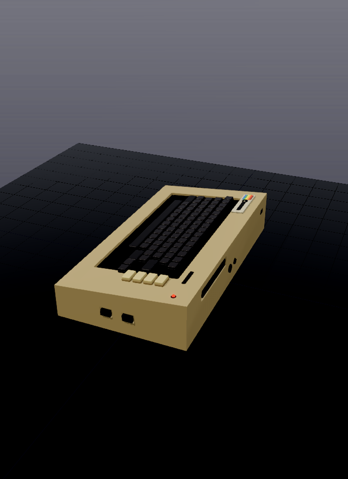
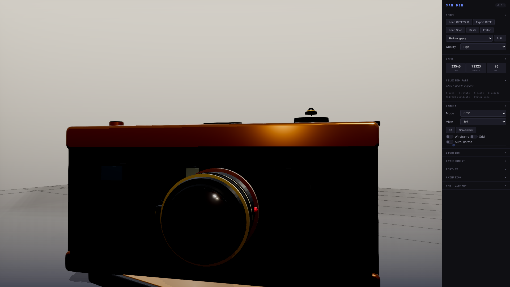
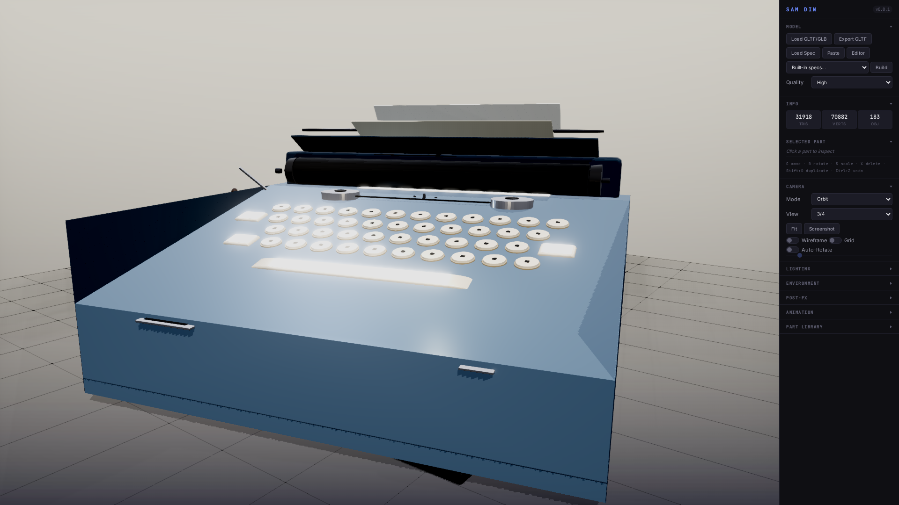
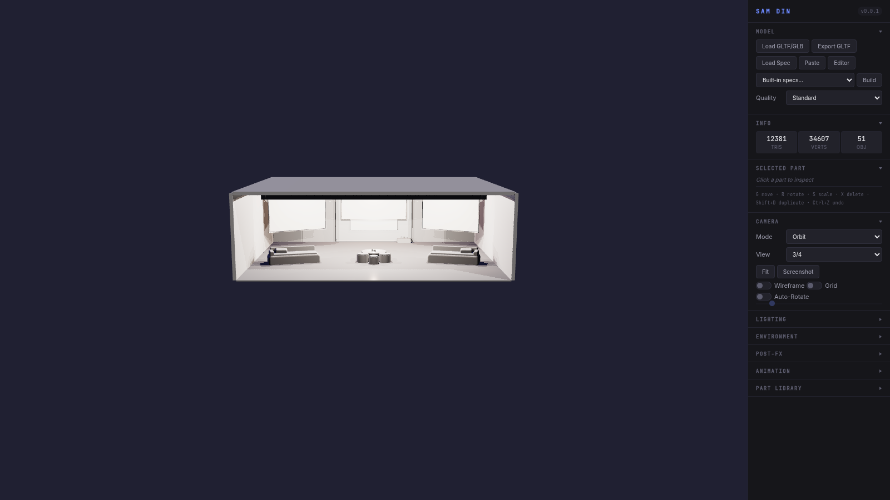

# Samdin

**JSON-based 3D scene builder, browser-native.** Compose primitives, prefabs, modules, nested CSG parts, and scene-level render settings from declarative specs. Three.js under the hood. No build step.

ส า ม มิ ติ — *three dimensions*.

[](media/c64.png)

<video src="https://github.com/mbarlow/samdin/raw/main/media/samdin-demo.webm" controls width="100%"></video>

The C64 above — wedge chassis, recessed keyboard well, stepped doubleshot keycaps, rainbow badge — is a single declarative JSON spec. Every angle came out of Samdin's in-browser first-person polaroid: step into the scene with WASD, line up the viewfinder, and the shot drops onto the polaroid strip for export.

## Quick start

```bash
make dev              # starts browser-sync on http://localhost:7777
make dev PORT=8888    # or pick your own port
```

Then open the URL, pick a spec from the **Built-in specs** dropdown or drop your own JSON into the editor. `make smoke` runs the CLI validator against `specs/showcase.json` as a health check.

## Gallery — the quality bar

Five hero specs anchor the current output ceiling. Full prompts in [docs/quality-bar.md](docs/quality-bar.md).

| | | |
|---|---|---|
| [](docs/quality-bar.md#field-radio) | [](docs/quality-bar.md#rangefinder-camera) | [](docs/quality-bar.md#espresso-machine) |
| [](docs/quality-bar.md#anglepoise-desk-lamp) | [](docs/quality-bar.md#olivetti-typewriter) | [](specs/clinic.json) |

## Docs

| | |
|---|---|
| [Scene spec format](docs/scene-spec.md) | Parts, modules, embedded CSG, scene-level lookdev, terrain compositor |
| [Primitives](docs/primitives.md) | Basic shapes, geometric solids, architectural, lathe/extrude, cables, lights, CSG |
| [Materials](docs/materials.md) | Preset library and custom material fields |
| [Prefabs](docs/prefabs.md) | 77 reusable components — vehicles, furniture, foliage, street, industrial, rocks |
| [Modifiers & part properties](docs/modifiers.md) | Array/mirror/scatter and the part schema |
| [Editor & shortcuts](docs/editor.md) | Blender-style G/R/S transforms, first-person mode, editor features |
| [Validation & inspection](docs/validation.md) | CLI validators, screenshot sweeps, example scenes |
| [Quality bar prompts](docs/quality-bar.md) | The five hero anchor prompts |
| [CLI reference](cli/README.md) | `validate-spec`, `inspect-model`, `export-playwright`, `index` |
| [Release notes](docs/RELEASE_NOTES.md) | Latest changes |

## Project layout

```
samdin/
├── src/                app entry: index.html + js/ + css/
├── specs/              scene specs (served at /specs)
├── prefabs/            reusable prefab JSON (served at /prefabs)
├── media/              images + demo video
├── cli/                validate / inspect / export tools
├── docs/               reference docs + thumbnails
└── scripts/dev.sh      browser-sync launcher
```

## License

MIT
