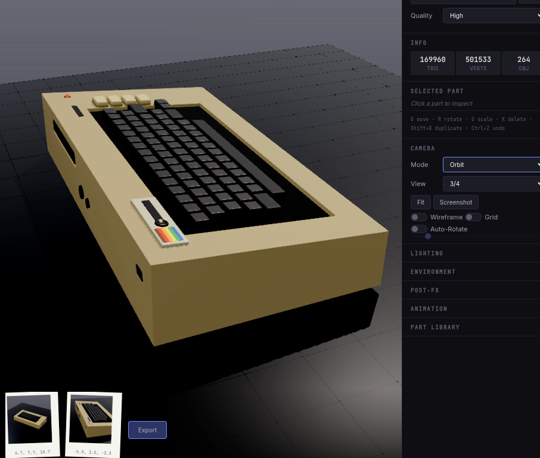
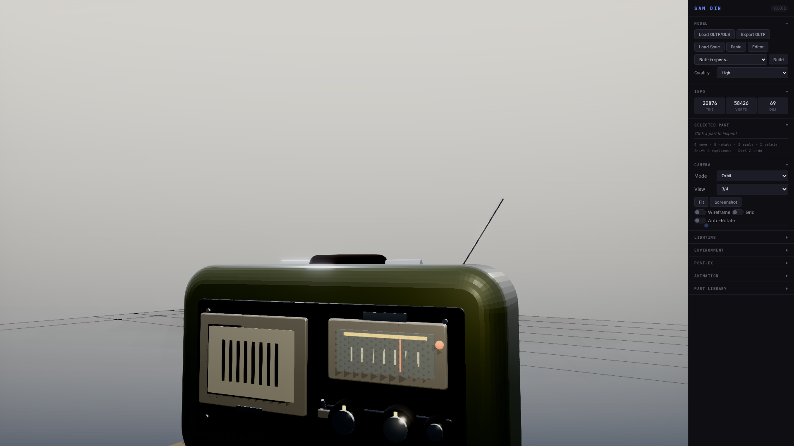
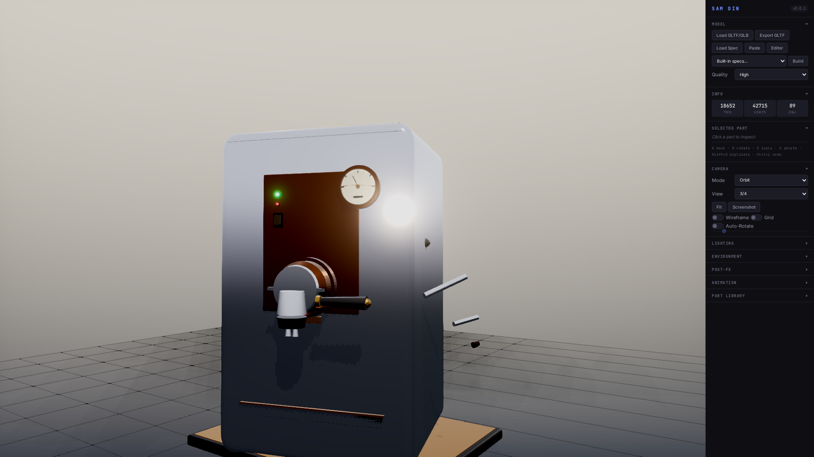
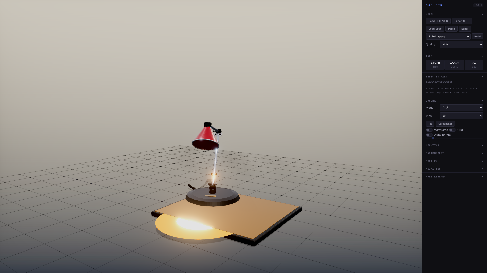

# Samdin

https://github.com/mbarlow/samdin/raw/main/samdin-demo.webm

<video src="samdin-demo.webm" controls width="100%"></video>




*A faithful recreation of the 1982 Commodore 64 breadbin — CSG-carved wedge chassis, recessed keyboard well, stepped doubleshot keycaps, and the unmistakable rainbow badge — built entirely from a single declarative JSON spec. Every angle captured above came out of Samdin's in-browser first-person polaroid feature: step into the scene with WASD, line up the viewfinder, and the shot drops onto the polaroid strip for export.*

A JSON-based 3D scene builder using Three.js. Create complex 3D scenes by composing primitives, prefabs, modules, nested CSG parts, and scene-level render settings through declarative JSON specifications.

Latest changes are summarized in [docs/RELEASE_NOTES.md](docs/RELEASE_NOTES.md).

## Example Prompts

Two specs anchor the current quality bar — both shipped in [`specs/`](specs/) and built from prompts. Drop a comparable prompt at an LLM and you should get a result in this neighborhood; if it lands lower, iterate on screenshots, not JSON.

### Field radio — [`specs/quality-bar-field-radio.json`](specs/quality-bar-field-radio.json)



> Build a hero-quality mid-century field radio. Rugged two-tone painted shell with darker side caps, recessed dark fascia framing two windows: a multi-layer speaker (bezel + wire-mesh + slat array + chrome badge) on the left, and an amber tuning dial (glow strip + tick marks + red needle behind glass) on the right. Knurled rubber knobs as reusable modules, top utility carry handle, telescoping antenna at angle. Stage on a small concrete plinth, studio lighting, restrained bloom, three-quarter camera tight on the prop.

### Rangefinder camera — [`specs/quality-bar-rangefinder-camera.json`](specs/quality-bar-rangefinder-camera.json)


> A 1960s 35mm rangefinder camera, Leica M-style. Brass top plate over vulcanite leatherette body wrap; multi-coated front lens element with real glass transmission; concentric multi-ring lens assembly (focus ring with rubber tab + distance scale band + aperture ring with engraved indices); rangefinder, viewfinder, and illuminator windows on the front; hot shoe, shutter speed dial, advance lever, frame counter window, rewind crank on top; eyepiece, LCD, and thumb rest on the back. Stage on a wood-and-leather plinth with brass lip. Match the field radio quality bar.

### Espresso machine — [`specs/quality-bar-espresso-machine.json`](specs/quality-bar-espresso-machine.json)



> A prosumer single-boiler espresso machine, E61-style group head. Mirror-polished chrome shell with brass front fascia plate; brass-trimmed group head with portafilter locked in (walnut handle, twin chrome spouts); pressure gauge with cream face, red over-pressure zone, black needle, and transmission glass; green READY LED + red power LED + rocker switch on the front; brass top warming plate with railed perimeter; chrome steam wand on the right with wood steam knob; chrome hot-water spout on the left with matching wood knob; stainless drip tray with slatted grate; demitasse cup of fresh espresso resting on the tray. Stage on the same wood-and-leather plinth used for the radio and camera. Active state — warm group-head glow, LEDs lit. Match the field radio and rangefinder camera quality bar.

### Anglepoise desk lamp — [`specs/quality-bar-anglepoise-lamp.json`](specs/quality-bar-anglepoise-lamp.json)



> A 1950s Anglepoise 1227 desk lamp, switched on, captured mid-pose with the arm angled forward over the plinth and the red shade tilted down to read the surface. Cast iron base, short vertical post, articulated joint chain (base → lower arm → elbow → upper arm → wrist → shade) with real joint groups and axle hardware; twin chrome tension springs at every joint, rendered as stacked helical coil tori; chrome arm tubes with polished reflective finish; brass end caps on the axles; red enamel bell-shaped shade with cream interior, chrome rim around the wide opening, brass bulb socket, warm glowing bulb inside. A warm three-tier emissive halo spills onto the leather plinth where the light lands. Power cord trailing from the base. Stage on the same wood-and-leather plinth as the other anchors. Match the field radio, rangefinder camera, and espresso machine quality bar.

### Olivetti typewriter — [`specs/quality-bar-typewriter.json`](specs/quality-bar-typewriter.json)


> A 1963 Olivetti Lettera 32 portable typewriter in signal blue, mid-typing with a sheet of paper in the carriage and two lines of typed text visible on the page plus a cursor mark where the next letter will land. CSG-carved wedge chassis with clean body seams and three chrome plates on the front (logo, engraving, model badge). Dense round cream keycaps with dark legend dots, arrayed in a four-row layout plus spacebar, shift, tab, and return. Carriage across the back: black rubber platen with visible rod through it, wood platen knobs on each end with chrome collars, angled metal paper rest, hinted ribbon spools, chrome carriage return lever angled down on the left. A few darker type bar hints rising toward the platen from inside the body. Rubber feet, plinth with wood + leather + brass lip to match the other anchors. First anchor with a cool palette to balance the warm-heavy set.

## Quick Start

1. Start the dev server: `make dev PORT=8888` (omit `PORT=` to use the default `7777`)
2. Open `http://localhost:8888` in a browser
3. Load a spec from the `specs/` folder or paste JSON into the editor
4. Use the viewer controls to orbit, pan, and zoom

See `make help` for other targets (`serve`, `smoke`).

## Scene Specification Format

```json
{
  "name": "my-scene",
  "description": "A sample scene",
  "root": "scene_root",
  "parts": [
    {
      "name": "scene_root",
      "type": "group",
      "position": [0, 0, 0]
    },
    {
      "name": "my_box",
      "type": "box",
      "params": [1, 1, 1],
      "material": { "preset": "wood" },
      "position": [0, 0.5, 0],
      "rotation": [0, 45, 0],
      "scale": [1, 1, 1],
      "parent": "scene_root"
    }
  ]
}
```

### Scene-Level Settings

Specs can also carry their own viewer/render mood:

```json
{
  "name": "scene-with-lookdev",
  "scene": {
    "background": { "type": "gradient", "color": "#d6d0c7", "color2": "#090a0c" },
    "fog": { "type": "exp2", "color": "#7a7772", "density": 0.02 },
    "lighting": { "preset": "industrialRuin", "intensity": 1.05, "shadowQuality": "high" },
    "exposure": 1.05,
    "toneMapping": "ACESFilmic",
    "camera": {
      "preset": "front",
      "distanceMultiplier": 0.45,
      "targetOffset": [0, -0.15, 0]
    },
    "postfx": {
      "ssao": { "enabled": true, "kernelRadius": 10, "minDistance": 0.004, "maxDistance": 0.16 },
      "bloom": { "enabled": true, "strength": 0.7, "radius": 0.35, "threshold": 0.72 },
      "colorGrade": { "enabled": true, "saturation": 0.85, "brightness": 0.95, "contrast": 1.08 },
      "fxaa": true
    }
  }
}
```

`scene.camera` supports `preset`, `fit`, `distanceMultiplier`, `scaleToModel`, `positionOffset`, and `targetOffset`. This is useful for scenes that need a specific gameplay or hero-shot framing without manually scaling the whole scene.

### Spec-Local Modules

Use top-level `modules` plus `type: "module"` instances to keep large scenes compositional:

```json
{
  "modules": {
    "signal-pylon": {
      "root": "pylon_root",
      "parts": [
        { "name": "pylon_root", "type": "group" },
        { "name": "shaft", "type": "box", "params": [1, 4, 1], "position": [0, 2, 0], "parent": "pylon_root" }
      ]
    }
  },
  "parts": [
    { "name": "pylon_a", "type": "module", "src": "signal-pylon", "position": [-5, 0, 0] },
    { "name": "pylon_b", "type": "module", "src": "signal-pylon", "position": [5, 0, 0] }
  ]
}
```

### Embedded CSG Parts

Parts-based specs can now host local boolean-op geometry directly:

```json
{
  "name": "ring",
  "type": "csg",
  "output": "final",
  "shapes": {
    "outer": { "type": "cylinder", "radius": 2, "height": 0.5, "position": [0, 0.25, 0] },
    "inner": { "type": "cylinder", "radius": 1.4, "height": 0.8, "position": [0, 0.4, 0] }
  },
  "operations": [
    { "op": "subtract", "a": "outer", "b": "inner", "result": "final" }
  ]
}
```

### Terrain Compositor

An optional middle-pass that drapes a single unified mesh ("physics blanket") over every part tagged `category: "environment"` — ground plates, cliffs, rocks, and other natural scatter — while leaving structures and props untouched. The generated mesh is attached under the model root as `__terrain__` so it rides along with GLB exports.

```json
{
  "scene": {
    "terrain": {
      "enabled": true,
      "method": "heightfield",
      "display": "terrain",
      "flipNormals": true,
      "bounds": "auto",
      "resolution": 96,
      "smoothing": 0.35,
      "material": { "color": "#506874", "roughness": 0.9, "flatShading": true },
      "methodOptions": {
        "heightfield": { "padding": 0.75, "skirt": 3.0 }
      }
    }
  },
  "parts": [
    { "name": "rock_a", "type": "prefab", "src": "rock-large", "category": "environment" }
  ]
}
```

| Field | Description |
|-------|-------------|
| `enabled` | Master switch. When `false` or omitted, the compositor is a no-op. |
| `method` | `"heightfield"` (2.5D raycast grid), `"marching-cubes"` (volumetric iso-surface, supports overhangs). `"cloth-drape"` is stubbed and falls back to heightfield. |
| `display` | `"primitives"` (hide terrain), `"terrain"` (hide env primitives), `"both"` (lookdev/debug). |
| `flipNormals` | Flip terrain normals if the surface reads inside-out. |
| `bounds` | `"auto"` (derived from env meshes + padding) or `[minX, minZ, maxX, maxZ]`. |
| `resolution` | Grid resolution, clamped to `[4, 1024]`. |
| `smoothing` | Gaussian smoothing pass, `[0, 1]`. |
| `material` | Standard material object applied to the generated mesh. |
| `methodOptions.heightfield` | `{ padding, skirt }` for the default heightfield sampler. |
| `methodOptions.marchingCubes` | `{ padding, isoLevel, smoothingPasses }` for the volumetric sampler (`isoLevel` in `[0.05, 0.95]`). |

Heightfield sampling rasterizes a grid over the bounds, raycasts top-down against the tagged env meshes, optionally smooths, and triangulates with a skirt. Marching-cubes builds a 3D density grid from the same raycasts (odd crossings per column mark interior voxels), smooths in 3D, and extracts an iso-surface — use it when the env meshes have overhangs or fused silhouettes that a heightfield flattens. Any part without `category: "environment"` is treated as a structure or prop and is rendered on top of the terrain.

The viewer exposes a **Terrain** dropdown that flips `display` live without a rebuild, and a **Flip Normals** button that targets the current selection or the `__terrain__` mesh by default. See [`specs/landscape-example.json`](specs/landscape-example.json) (heightfield), [`specs/landscape-marching-cubes.json`](specs/landscape-marching-cubes.json), and [`specs/landscape-stress.json`](specs/landscape-stress.json) for working examples.

## Primitives

### Basic Shapes

| Type | Params | Description |
|------|--------|-------------|
| `box` | `[width, height, depth]` | Rectangular box |
| `sphere` | `[radius, detail]` | Sphere (detail 0-3) |
| `cylinder` | `[radiusTop, radiusBottom, height, segments]` | Cylinder or cone |
| `cone` | `[radius, height, segments]` | Cone |
| `torus` | `[radius, tube, radialSegments, tubularSegments]` | Donut shape |
| `capsule` | `[radius, length, capSegments, radialSegments]` | Pill shape |
| `plane` | `[width, height]` | Flat plane |
| `ring` | `[innerRadius, outerRadius, segments]` | Flat ring |

### Geometric Solids

| Type | Params | Description |
|------|--------|-------------|
| `tetrahedron` | `[radius]` | 4-sided solid |
| `octahedron` | `[radius]` | 8-sided solid |
| `dodecahedron` | `[radius]` | 12-sided solid |
| `icosahedron` | `[radius, detail]` | 20-sided solid |
| `prism` | `[radius, height, sides]` | N-sided prism |
| `pyramid` | `[baseWidth, height]` | Square pyramid |
| `wedge` | `[width, height, depth]` | Triangular wedge |

### Architectural

| Type | Params | Description |
|------|--------|-------------|
| `roundedBox` | `[width, height, depth, radius, segments]` | Box with rounded edges |
| `stairs` | `[width, height, depth, steps]` | Staircase |
| `arch` | `[width, height, depth, segments]` | Archway |
| `tube` | `[outerRadius, innerRadius, height, segments]` | Hollow cylinder |
| `dome` | `[radius, widthSegments, heightSegments, phiLength]` | Hemisphere/dome |

### Lathe & Extrusion

| Type | Params | Description |
|------|--------|-------------|
| `lathe` | `[points, segments, phiStart, phiLength]` | Revolve 2D profile around Y axis |
| `extrudePath` | `[shape, shapeParams, waypoints, segments, closed]` | Extrude shape along curved path |

**Lathe example** (wine glass):
```json
{
  "type": "lathe",
  "params": [
    [[0.06, 0], [0.06, 0.01], [0.01, 0.02], [0.01, 0.15], [0.03, 0.2], [0.06, 0.35]],
    12
  ]
}
```

**ExtrudePath shapes**: `"circle"` `[radius]`, `"square"` `[size]`, `"rectangle"` `[width, height]`

### Cables & Wires

| Type | Params | Description |
|------|--------|-------------|
| `cable` | `[waypoints, radius, segments, radialSegments, tension]` | Smooth cable along waypoints |
| `catenary` | `[start, end, sag, radius, segments, radialSegments]` | Gravity-sagging cable between points |

**Tension options**: `"tight"`, `"normal"`, `"loose"`

**Catenary example** (power line):
```json
{
  "type": "catenary",
  "params": [[-3, 2.8, 0], [3, 2.8, 0], 0.2, 0.015, 24, 6]
}
```

### Lights

| Type | Params | Description |
|------|--------|-------------|
| `pointLight` | `[intensity, distance, decay, showBulb, bulbSize]` | Omnidirectional light |
| `spotLight` | `[intensity, distance, angle, penumbra, showCone]` | Directional cone light |
| `areaLight` | `[width, height, intensity, showPanel]` | Rectangular soft light |

Light color is set via `material.color`:
```json
{
  "type": "pointLight",
  "params": [2, 10, 2, true, 0.08],
  "material": { "color": "#ffaa44" },
  "position": [0, 2, 0]
}
```

### CSG (Constructive Solid Geometry)

Complex shapes created via boolean operations:

| Type | Params | Description |
|------|--------|-------------|
| `ibeam` | `[width, height, length, flangeThickness, webThickness]` | I-beam structural |
| `lbeam` | `[width, height, length, thickness]` | L-shaped angle |
| `tbeam` | `[width, height, length, flangeThickness, webThickness]` | T-beam |
| `channel` | `[width, height, length, thickness]` | C-channel |
| `hbeam` | `[width, height, length, flangeThickness, webThickness]` | H-beam |
| `angle` | `[width, height, length, thickness]` | Angle bracket |
| `hollowBox` | `[width, height, depth, wallThickness]` | Hollow rectangular tube |
| `hollowCylinder` | `[outerRadius, innerRadius, height, segments]` | Pipe/tube |
| `pipeFlange` | `[pipeRadius, flangeRadius, flangeThickness, pipeLength, boltHoles]` | Pipe flange |
| `elbow` | `[radius, tubeRadius, angle, segments]` | Pipe elbow |
| `bracket` | `[width, height, depth, thickness, holeRadius]` | Mounting bracket |
| `gear` | `[radius, teeth, thickness, toothDepth]` | Gear wheel |
| `cross` | `[armLength, armWidth, thickness]` | Plus/cross shape |
| `frame` | `[width, height, thickness, depth]` | Picture frame |
| `windowFrame` | `[width, height, frameWidth, frameDepth, divisions]` | Window with panes |
| `hexNut` | `[radius, height, holeRadius]` | Hexagonal nut |
| `countersunk` | `[headRadius, shaftRadius, headHeight, shaftLength]` | Countersunk screw |
| `keyhole` | `[width, height, depth, holeRadius, slotWidth]` | Keyhole mount |
| `halfTorus` | `[radius, tube, segments]` | Half donut |
| `sphereSlab` | `[radius, thickness]` | Sliced sphere |
| `notchedCylinder` | `[radius, height, notchWidth, notchDepth, segments]` | Cylinder with notch |
| `steppedPyramid` | `[baseWidth, height, steps]` | Mayan-style pyramid |
| `boxSphereIntersect` | `[boxSize, sphereRadius]` | Rounded cube |
| `cylinderIntersect` | `[radius, height, segments]` | Cylinder intersection |
| `swissCheese` | `[width, height, depth, holeRadius, holeCount]` | Block with random holes |

## Material Presets

Use `"material": { "preset": "name" }` or combine with color: `{ "preset": "wood", "color": "#d4a574" }`

### Metals
| Preset | Description |
|--------|-------------|
| `chrome` | Shiny chrome mirror |
| `steel` | Brushed steel |
| `metal` | Generic metal |
| `gold` | Gold metallic |
| `brass` | Brass finish |
| `copper` | Copper finish |
| `painted-metal` | Painted metal surface |
| `rusted-metal` | Oxidized rusty metal |

### Building Materials
| Preset | Description |
|--------|-------------|
| `concrete` | Concrete surface |
| `asphalt` | Road asphalt |
| `brick` | Brick material |
| `tile` | Ceramic tile |
| `cinder-block` | Cinder block |
| `wall-paint` | Painted wall |

### Natural
| Preset | Description |
|--------|-------------|
| `wood` | Wood grain |
| `fence-wood` | Weathered fence wood |
| `grass` | Grass surface |
| `dirt-path` | Dirt/earth path |
| `foliage` | Leaf/plant material |
| `water` | Water surface |

### Fabrics & Soft
| Preset | Description |
|--------|-------------|
| `fabric` | Cloth material |
| `leather` | Leather surface |
| `cushion` | Soft cushion |
| `carpet` | Carpet texture |
| `rubber` | Rubber material |

### Glass & Transparent
| Preset | Description |
|--------|-------------|
| `glass` | Clear glass |
| `glass-tinted` | Tinted glass |

### Other
| Preset | Description |
|--------|-------------|
| `plastic` | Plastic surface |
| `ceramic` | Ceramic/porcelain |
| `matte` | Matte finish |

### Emissive/Glow
| Preset | Description |
|--------|-------------|
| `glow` | Glowing emissive |
| `neon` | Neon light effect |
| `screen` | LCD/LED screen |
| `rgb` | RGB LED strip |
| `sky` | Sky gradient |
| `cloud` | Cloud material |

### Custom Materials

```json
{
  "material": {
    "color": "#ff5500",
    "metalness": 0.8,
    "roughness": 0.2,
    "emissive": "#ff0000",
    "emissiveIntensity": 0.5,
    "flatShading": true
  }
}
```

## Prefabs

Reusable model components. Use `"type": "prefab"` with `"src": "prefab-name"`:

```json
{
  "name": "my_chair",
  "type": "prefab",
  "src": "office-chair",
  "position": [2, 0, 0],
  "rotation": [0, 90, 0],
  "scale": [1, 1, 1]
}
```

### Available Prefabs (77 total)

The authoritative list is the contents of `prefabs/`. The tables below group them for browsing.

#### Vehicles (12)
| Prefab | Description |
|--------|-------------|
| `sedan` | Four-door family car |
| `sports-car` | Low-profile sports car with spoiler |
| `suv` | Sport utility vehicle with roof rack |
| `pickup-truck` | Pickup truck with open bed |
| `truck-semi` | Semi truck with attached trailer |
| `van` | Cargo/delivery van |
| `bus` | City transit bus |
| `motorbike` | Motorcycle |
| `tuk-tuk` | Three-wheeled taxi |
| `speedboat` | Motorboat with outboard |
| `bicycle` | Road bicycle |
| `scooter` | Electric kick scooter |

#### Trees & Plants (13)
| Prefab | Description |
|--------|-------------|
| `oak-tree` | Broad deciduous with spreading canopy |
| `pine-tree` | Tall coniferous with layered branches |
| `birch-tree` | Slender tree with white bark |
| `palm-tree` | Tropical palm with fronds |
| `willow-tree` | Weeping willow with drooping branches |
| `cypress-tree` | Tall narrow Italian cypress |
| `maple-tree` | Japanese maple with red canopy |
| `dead-tree` | Leafless dead tree with bare branches |
| `lowpoly-tree` | Simple stylized tree |
| `hedge-box` | Trimmed boxwood hedge section |
| `shrub-round` | Round decorative shrub |
| `bush-flowering` | Flowering bush with pink blooms |
| `topiary-spiral` | Spiral topiary in pot |

#### Furniture & Appliances (19)
| Prefab | Description |
|--------|-------------|
| `bed` | Queen bed with nightstands |
| `sofa` | Three-seat sofa with cushions |
| `armchair` | Upholstered armchair |
| `office-chair` | Ergonomic office chair |
| `kitchen-chair` | Simple wooden chair |
| `desk` | Modern desk with drawers |
| `dining-table` | Table with four chairs |
| `coffee-table` | Rectangular coffee table |
| `side-table` | Round pedestal side table |
| `tv-stand` | Media console with shelves |
| `bookshelf` | Bookshelf with books and decor |
| `wardrobe` | Two-door wardrobe |
| `dresser` | Six-drawer dresser |
| `floor-lamp` | Standing lamp with shade |
| `table-lamp` | Table lamp with ceramic base |
| `kitchen-counter` | L-shaped kitchen counter with sink and cabinets |
| `refrigerator` | Double-door refrigerator with freezer compartment |
| `stove` | Kitchen stove with four burners and oven |
| `workbench` | Industrial workbench with pegboard |

#### Building Components (8)
| Prefab | Description |
|--------|-------------|
| `door` | Interior door with frame |
| `window` | Double-hung window |
| `staircase` | Stairs with railings |
| `wall-section` | Modular wall panel |
| `floor-tile` | Modular floor section |
| `roof-section` | Angled roof panel with shingles |
| `fence-section` | Wooden picket fence section |
| `collapsed-wall` | Partially collapsed concrete wall with debris |

#### Street & Outdoor (10)
| Prefab | Description |
|--------|-------------|
| `street-lamp` | Street light pole |
| `park-bench` | Wooden park bench |
| `trash-can` | Public waste bin |
| `fire-hydrant` | Red fire hydrant |
| `shopping-cart` | Metal shopping cart |
| `bus-stop` | Bus shelter with bench |
| `stop-sign` | Octagonal stop sign on metal pole |
| `traffic-light` | Traffic signal with three lights on pole |
| `power-pole` | Utility power pole with crossarm and catenary wires |
| `japanese-lantern` | Stone Japanese garden lantern (toro) with emissive interior |

#### Figures & Structures (4)
| Prefab | Description |
|--------|-------------|
| `human-figure` | Simple standing person |
| `human-sitting` | Seated human figure |
| `seven-eleven` | Convenience store |
| `street-vendor` | Food cart/stall |

#### Industrial & Ruin (8)
| Prefab | Description |
|--------|-------------|
| `catwalk-segment` | Grated catwalk with rails and hazard glow |
| `pipe-rack` | Steel rack with bundled pipes and valve wheel |
| `factory-wall-bay` | Machine wall panel with conduit and warning slot |
| `broken-column` | Pale civic column broken by chipped CSG cuts |
| `arch-fragment` | Broken arch chunk with debris block |
| `machine-altar` | Boss/ritual pedestal with emissive core |
| `hazard-gate` | Heavy gate frame with warning strips and sensors |
| `shipping-container` | 20ft shipping container with corrugated walls and doors |

#### Rocks & Debris (3)
| Prefab | Description |
|--------|-------------|
| `rock-large` | Large boulder with irregular shape |
| `rock-cluster` | Cluster of smaller rocks grouped together |
| `rubble-pile` | Pile of concrete and brick rubble debris |

## Procedural Modifiers

Modifiers can be written either on the part directly (`array`, `mirror`, `scatter`) or under `modifiers`.

### Array Modifier
Duplicate parts in a pattern:
```json
{
  "name": "fence_post",
  "type": "cylinder",
  "params": [0.05, 0.05, 1, 6],
  "modifiers": {
    "array": { "count": 10, "offset": [0.5, 0, 0] }
  }
}
```

### Mirror Modifier
Mirror across axes:
```json
{
  "modifiers": {
    "mirror": { "x": true, "y": false, "z": false }
  }
}
```

### Scatter Modifier
Random distribution:
```json
{
  "modifiers": {
    "scatter": { "count": 20, "radius": 5, "randomRotation": true }
  }
}
```

## Part Properties

| Property | Type | Description |
|----------|------|-------------|
| `name` | string | Unique identifier (required) |
| `type` | string | Primitive type or "prefab" or "group" |
| `params` | array | Parameters for the primitive |
| `material` | object | Material definition |
| `position` | [x, y, z] | Position in world/parent space |
| `rotation` | [x, y, z] | Rotation in degrees |
| `scale` | [x, y, z] | Scale multiplier |
| `parent` | string | Name of parent part |
| `pivot` | string | Pivot point: "center", "bottom", "top" |
| `castShadow` | boolean | Whether to cast shadows |
| `receiveShadow` | boolean | Whether to receive shadows |
| `visible` | boolean | Visibility toggle |
| `comment` | string | Documentation comment |

## Example Scenes

### Primitive Tests
- `specs/lathe-test.json` - Lathe examples (vases, glasses, goblets)
- `specs/cables-test.json` - Cables, catenaries, and pipes
- `specs/lights-test.json` - Light primitive examples

### Prefab Tests
- `specs/furniture-test.json` - Furniture in room layouts
- `specs/vehicles-test.json` - All vehicle types

### Showcase Scenes
- `specs/showcase.json` - Combined feature showcase
- `specs/clinic.json` - Clinic interior scene
- `specs/motorcycle-street.json` - Motorcycle on a street scene
- `prefabs/prefab-test.json` - Street scene with prefabs

## Validation & Inspection

- Validate specs from the CLI: `node cli/validate-spec.cjs specs/showcase.json`
- Inspect a spec with screenshots + review template: `node cli/inspect-model.js specs/showcase.json /tmp/showcase-inspect`
- Inspection now also captures the spec-defined first camera as `*-specCamera.png` before running the preset sweep.

## Keyboard Shortcuts

### Transform (Blender-style)

Select a part by clicking it, then use these hotkeys:

| Key | Action |
|-----|--------|
| `G` | **Grab/Move** — enter translate mode (drag to move, click/Enter to confirm) |
| `R` | **Rotate** — enter rotate mode |
| `S` | **Scale** — enter scale mode |
| `X` | **Axis constrain** (in transform mode) — lock to X axis |
| `Y` | **Axis constrain** (in transform mode) — lock to Y axis |
| `Z` | **Axis constrain** (in transform mode) — lock to Z axis |
| `Escape` | **Cancel** current transform (reverts to original) |
| `Enter` / click | **Confirm** current transform |
| `Ctrl` (hold) | **Snap** — translate 0.25 units, rotate 15°, scale 0.1 increments |

### Edit Operations

| Key | Action |
|-----|--------|
| `X` | **Delete** selected part (when not in transform mode) |
| `Shift+D` | **Duplicate** selected part (offset copy + spec entry) |
| `Ctrl+Z` | **Undo** last transform/delete/duplicate |
| `Ctrl+Shift+Z` | **Redo** |

### First-Person Mode

| Key | Action |
|-----|--------|
| `W` / `↑` | Move forward |
| `S` / `↓` | Move backward |
| `A` / `←` | Strafe left |
| `D` / `→` | Strafe right |
| `Space` | Move up |
| `Shift` | Move down |
| `Escape` | Exit first-person mode |

All transforms sync back to the spec JSON so exports reflect edits.

## Editor Features

- **Grid Overlay**: Toggle reference grid
- **Part Highlighting**: Click to select parts
- **Transform Gizmos**: Blender-style G/R/S modal transforms with axis constraining
- **Undo/Redo**: Full undo stack for transforms, deletes, and duplicates
- **Spec Editor**: Edit JSON in real-time
- **Part Library**: Browse available primitives
- **Validation**: Automatic spec validation

## License

MIT
