# Samdin Prefab Inventory

> Generated 2026-04-02 via automated inspection (`cli/inspect-model.js`) + visual review.

## Overview

| Metric | Value |
|--------|-------|
| Total prefabs | 76 (+ 1 test scene) |
| Categories | 9 |
| Avg quality | 5.9 / 10 |
| Total unique tris | ~128k (excluding prefab-test) |
| Style | Low-poly / stylized primitives |

All prefabs use a consistent JSON parts-based format with material presets, CSG booleans, and hierarchical parenting. The overall style is **low-poly stylized** — suitable for scene composition, prototyping, and stylized rendering. Not intended for photorealistic work.

## Systemic Issues

1. **Very dark default lighting** — many prefabs are hard to see in the default studio preset. Dark materials (office-chair, pipe-rack, shopping-cart) nearly disappear.
2. **Small screen presence** — smaller props (bicycle, scooter, fire-hydrant, table-lamp) render tiny in the default camera framing.
3. **Inconsistent poly density** — some prefabs use roundedBox (high tris) while similar ones use plain box. e.g. sedan (6740 tris) vs sports-car (456 tris).
4. **No material breakup on most prefabs** — only industrial/ruin prefabs use noise, grime, and edgeWear. Furniture and vehicles are flat-shaded.
5. **Missing interior detail** — vehicles have no dashboard/seats visible through windows; buildings have no interior.

---

## Vehicles (12)

| Prefab | Thumbnail | Tris | Verts | Obj | Description | Quality | Issues |
|--------|-----------|------|-------|-----|-------------|---------|--------|
| `sedan` | 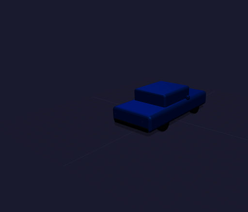 | 6,740 | 19,528 | 33 | Four-door family car, blue, roundedBox body | 6 | Boxy but good silhouette; no wheel wells; headlights glow nicely |
| `truck-semi` | 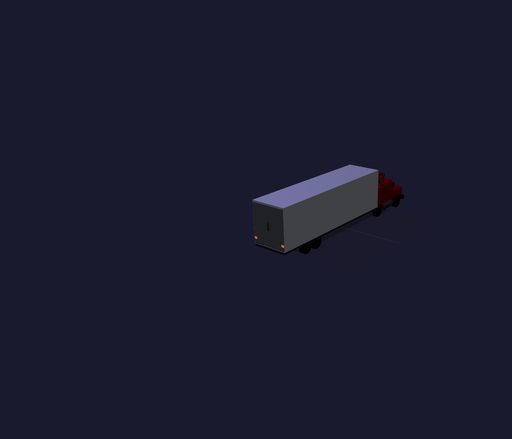 | 3,452 | 9,072 | 39 | Red semi truck with grey trailer | 7 | Good proportions; cab deflector, exhausts, fuel tanks; chrome details |
| `sports-car` | 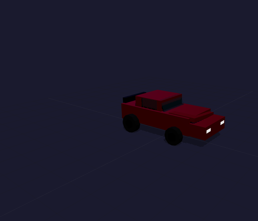 | 456 | 800 | 22 | Low-profile red sports car with spoiler | 4 | Extremely low poly vs sedan; all plain boxes; no curves |
| `suv` | 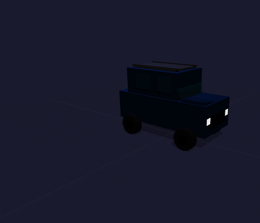 | 476 | 848 | 25 | Boxy SUV with roof rack, dark blue | 4 | Very blocky; roof rack is nice detail; no glass tinting |
| `pickup-truck` | 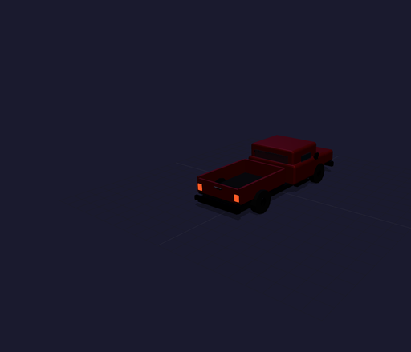 | 6,112 | 17,660 | 33 | Red/brown pickup with open bed | 6 | Good detail; roundedBox body; glowing headlights; decent proportions |
| `van` | 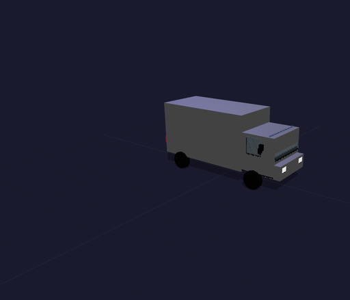 | 360 | 640 | 18 | Grey delivery/cargo van | 4 | Very simple box shapes; barely reads as van vs truck |
| `bus` | 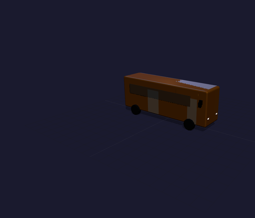 | 1,020 | 2,556 | 19 | Orange city transit bus with windows | 5 | Recognizable silhouette; good color; windows are flat |
| `motorbike` | 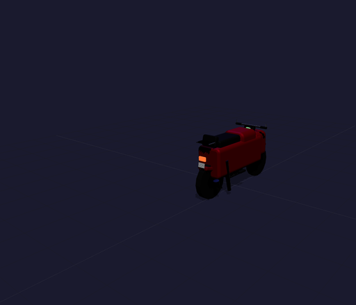 | 8,388 | 23,617 | 43 | Red motorcycle, high detail | 7 | Best vehicle quality; engine, exhaust, handlebars; very small on screen |
| `tuk-tuk` | 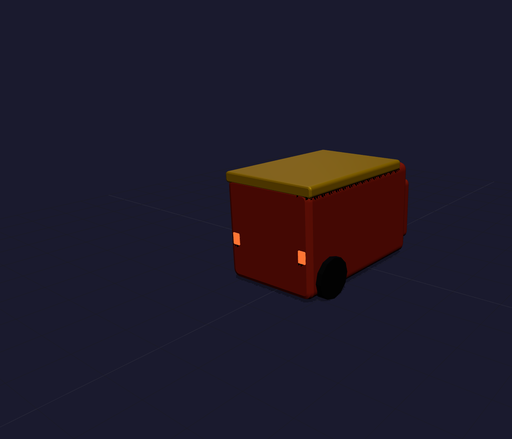 | 5,208 | 15,388 | 13 | Orange/red three-wheeled taxi | 6 | Charming; rounded body; good character |
| `speedboat` | 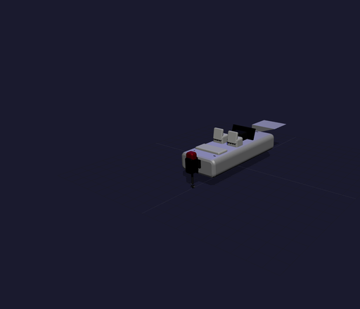 | 6,708 | 19,225 | 30 | White motorboat with outboard | 6 | Good hull shape; seats, windscreen, motor visible |
| `bicycle` | 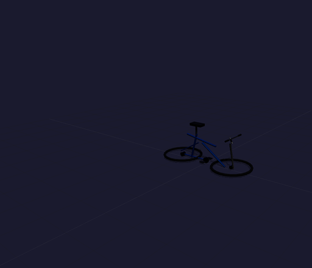 | 1,180 | 1,142 | 19 | Road bicycle | 5 | Correct proportions; thin tubes hard to see; dark materials |
| `scooter` | 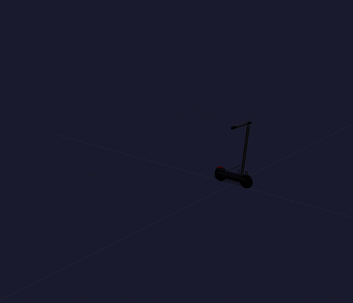 | 868 | 2,272 | 10 | Electric kick scooter | 4 | Very thin/small; hard to identify at distance; dark |

**Vehicle avg quality: 5.3**

---

## Trees & Plants (13)

| Prefab | Thumbnail | Tris | Verts | Obj | Description | Quality | Issues |
|--------|-----------|------|-------|-----|-------------|---------|--------|
| `oak-tree` | 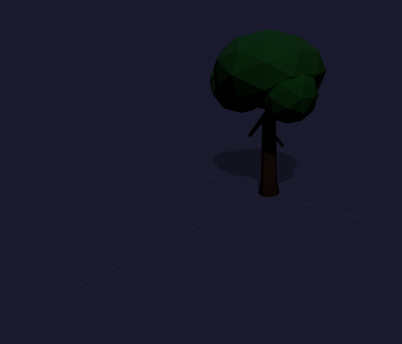 | 432 | 1,144 | 8 | Broad deciduous with spreading canopy | 5 | Spherical icosahedron canopy; reads as tree; no branch detail |
| `dead-tree` | 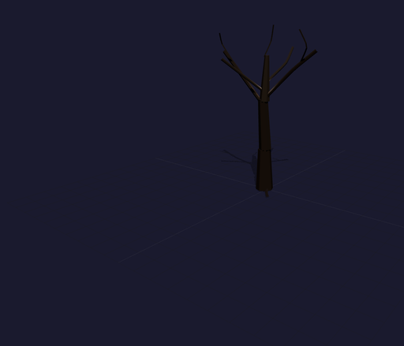 | 964 | 717 | 12 | Leafless dead tree with bare cable branches | 7 | Great silhouette; exposed roots; cable branches give natural feel |
| `pine-tree` | 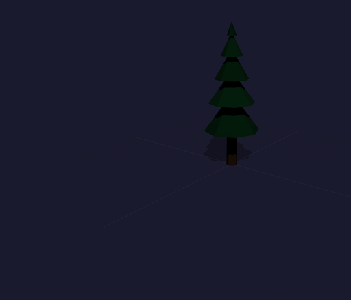 | 108 | 219 | 6 | Tall coniferous with layered branches | 5 | Stacked cones; classic low-poly pine; very few tris |
| `birch-tree` | 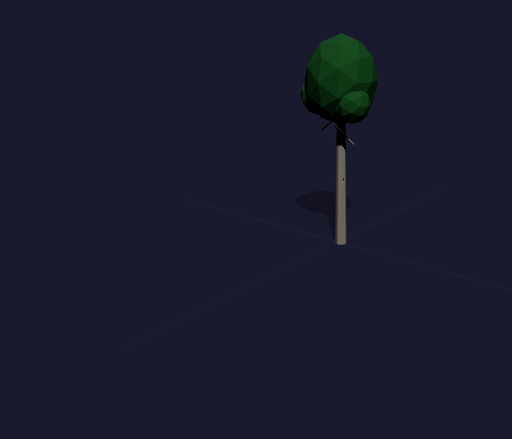 | 356 | 924 | 9 | Slender tree with white bark trunk | 6 | White trunk stands out nicely; green icosahedron canopy |
| `palm-tree` | 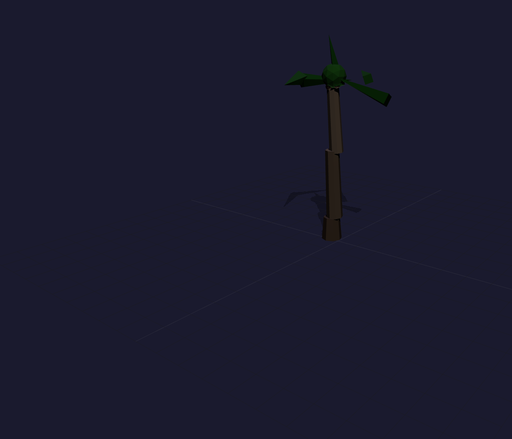 | 376 | 971 | 11 | Tropical palm with fronds | 6 | Good trunk curve; extruded fronds have nice shape |
| `willow-tree` | 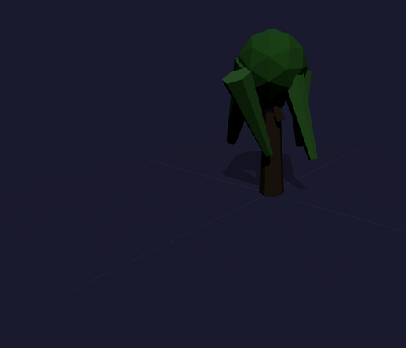 | 280 | 572 | 9 | Weeping willow with drooping branches | 5 | Drooping branch shapes work; could use more fronds |
| `cypress-tree` | 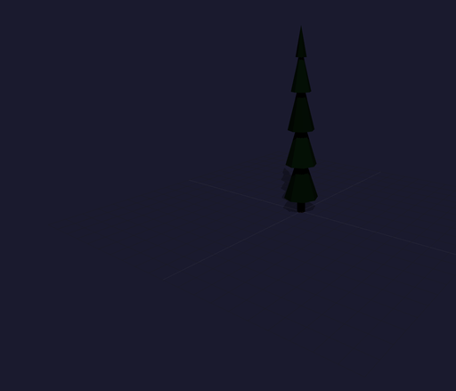 | 100 | 207 | 6 | Tall narrow Italian cypress | 5 | Very minimal; stacked cones; reads at distance |
| `maple-tree` | 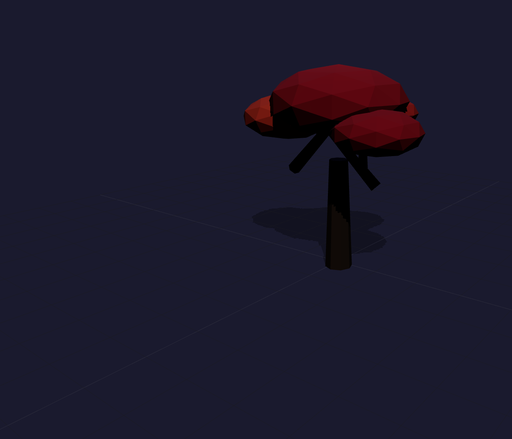 | 424 | 1,132 | 8 | Japanese maple with red canopy | 6 | Red color is distinctive; multi-cluster canopy |
| `lowpoly-tree` | 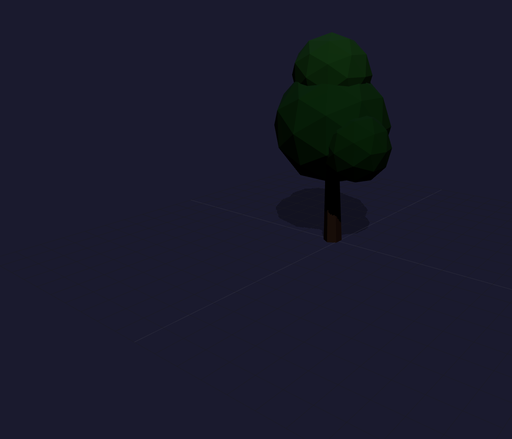 | 344 | 1,000 | 5 | Simple stylized tree | 6 | Classic low-poly aesthetic; stacked icosahedrons; clean |
| `hedge-box` | 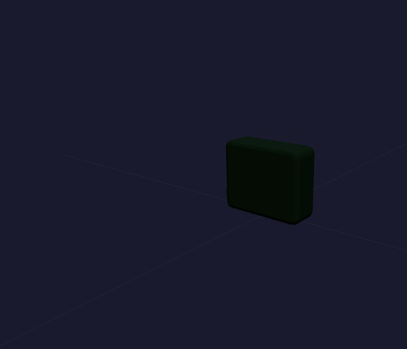 | 620 | 1,860 | 1 | Trimmed boxwood hedge section | 5 | Single rounded box; functional for fencing; very simple |
| `shrub-round` | 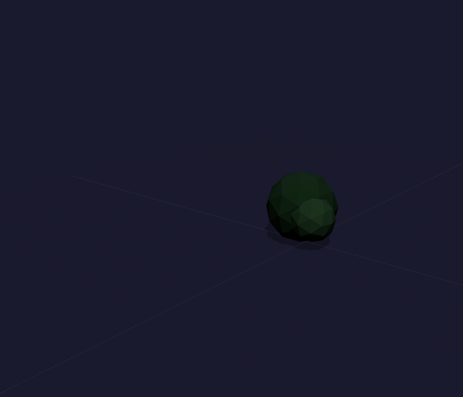 | 240 | 720 | 3 | Round decorative shrub | 5 | Stacked spheres; reads as bush; minimal |
| `bush-flowering` | 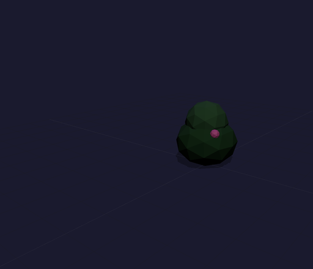 | 560 | 1,680 | 7 | Flowering bush with pink blooms | 6 | Pink bloom accents add character; multi-sphere canopy |
| `topiary-spiral` | 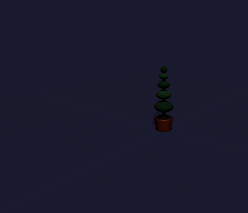 | 520 | 1,337 | 8 | Spiral topiary in pot | 6 | Terracotta pot + spiral shape; distinctive silhouette |

**Trees avg quality: 5.6**

---

## Furniture (18)

| Prefab | Thumbnail | Tris | Verts | Obj | Description | Quality | Issues |
|--------|-----------|------|-------|-----|-------------|---------|--------|
| `bed` | 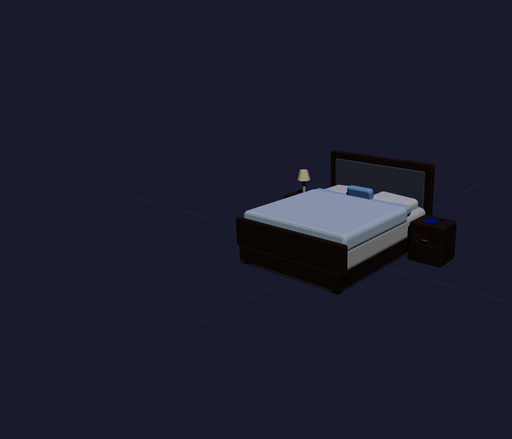 | 8,292 | 24,596 | 26 | Queen bed with nightstands and lamp | 7 | Best furniture piece; headboard, pillows, nightstands; good composition |
| `kitchen-counter` | 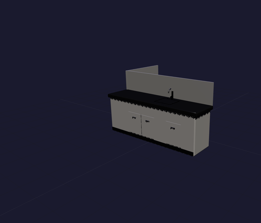 | 2,915 | 8,074 | 16 | L-shaped counter with sink and cabinets | 7 | Dark granite top, white cabinets, faucet, backsplash tile; great detail |
| `refrigerator` | 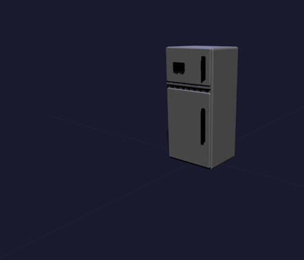 | 3,780 | 11,264 | 9 | Double-door fridge with ice dispenser | 7 | Chrome handles, freezer/fridge divider, ice dispenser panel |
| `stove` | 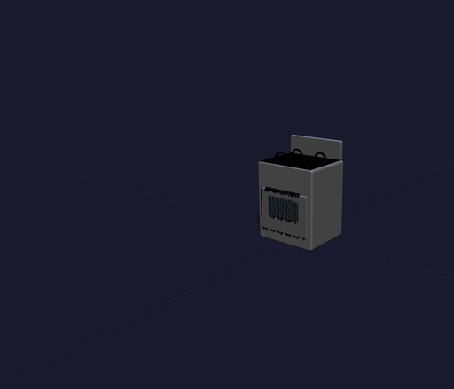 | 3,668 | 8,324 | 14 | Kitchen stove with four burners and oven | 7 | Torus burners, oven window, chrome handle, knobs; excellent detail |
| `sofa` | 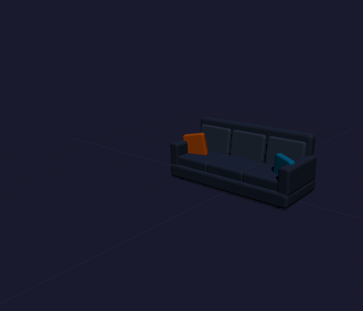 | 7,536 | 22,480 | 16 | Three-seat sofa with throw pillows | 7 | Colorful pillows add life; clean rounded cushions; nice material variety |
| `armchair` | 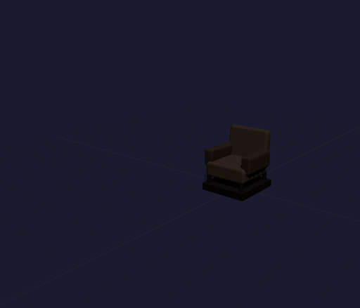 | 2,588 | 7,624 | 9 | Upholstered armchair | 6 | Brown fabric reads well; blocky but recognizable |
| `office-chair` | 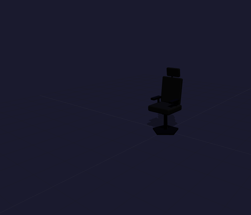 | 3,844 | 11,374 | 17 | Ergonomic office chair with wheels | 5 | Very dark materials; hard to see; has wheels, armrests, headrest |
| `kitchen-chair` | 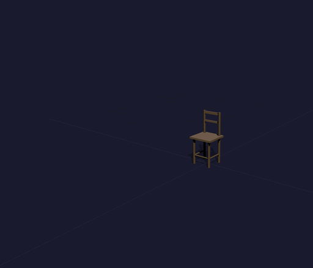 | 204 | 352 | 10 | Simple wooden chair | 5 | Very low poly; basic box legs and seat; functional |
| `desk` | 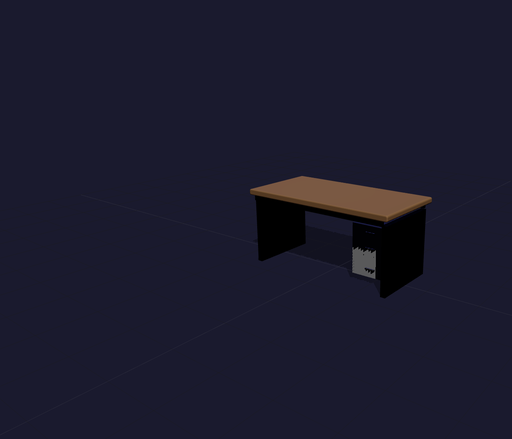 | 928 | 2,408 | 18 | Modern desk with drawers | 6 | Drawers, shelf, monitor stand area; good detail for tri count |
| `dining-table` | 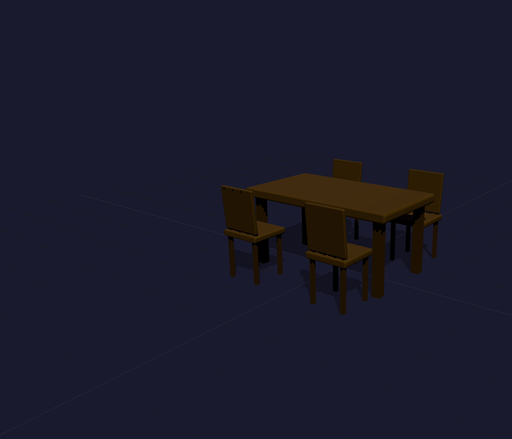 | 5,820 | 17,220 | 29 | Table with four chairs | 7 | Complete dining set; chairs have rounded backs; good scene filler |
| `coffee-table` | 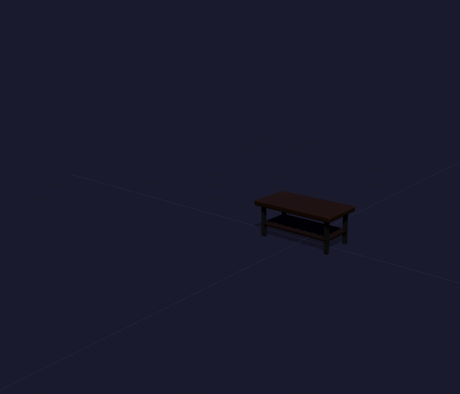 | 680 | 1,980 | 6 | Rectangular coffee table | 5 | Simple but clean; rounded edges; functional |
| `side-table` | 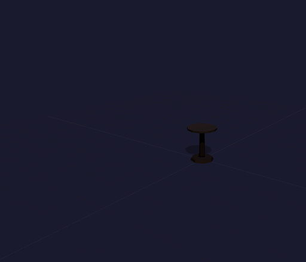 | 112 | 180 | 3 | Round pedestal side table | 4 | Extremely simple; cylinder + disc; barely registers |
| `tv-stand` | 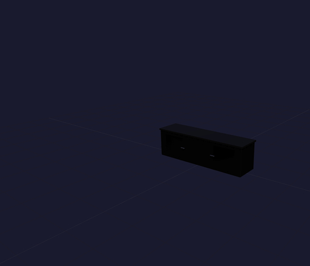 | 752 | 2,108 | 10 | Media console with shelves | 5 | Functional; has screen, shelves, legs; basic |
| `bookshelf` | 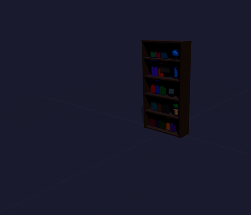 | 588 | 1,308 | 33 | Bookshelf with books and decor | 7 | Excellent — colorful books, globe, decorative items on shelves |
| `wardrobe` | 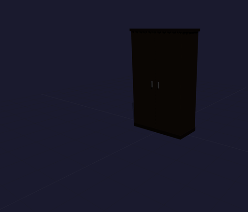 | 156 | 296 | 11 | Two-door wardrobe | 4 | Very basic boxes; minimal detail; no handles visible |
| `dresser` | 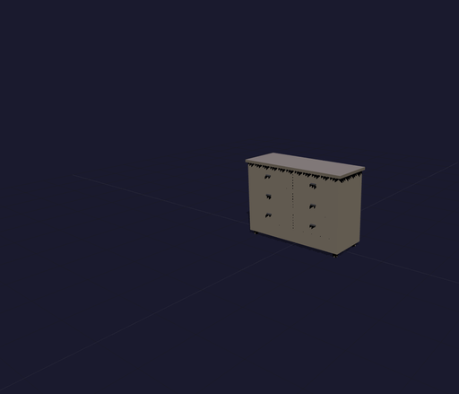 | 336 | 592 | 18 | Six-drawer dresser | 5 | Has drawer detail but very simple overall |
| `floor-lamp` | 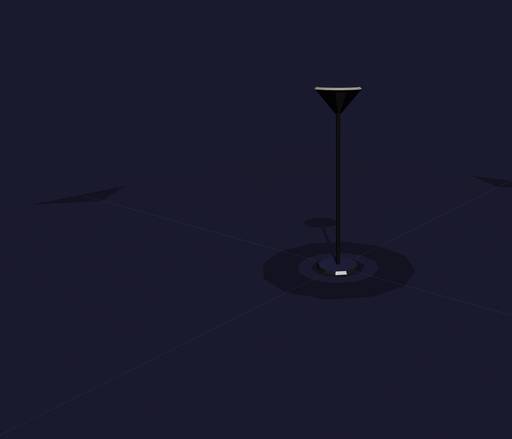 | 232 | 420 | 4 | Standing lamp with shade | 5 | Cone shade + cylinder pole; functional; emissive glow possible |
| `table-lamp` | 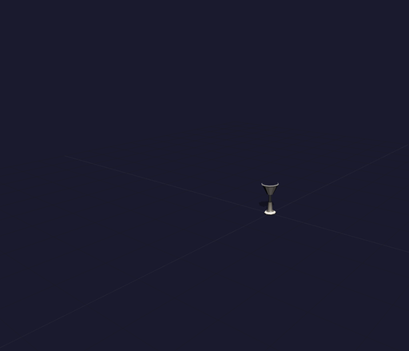 | 256 | 386 | 4 | Table lamp with ceramic base | 5 | Similar to floor lamp; small; has base, shade |

**Furniture avg quality: 5.8**

---

## Building Components (7)

| Prefab | Thumbnail | Tris | Verts | Obj | Description | Quality | Issues |
|--------|-----------|------|-------|-----|-------------|---------|--------|
| `door` | 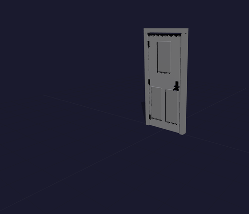 | 2,644 | 7,740 | 14 | Interior panel door with frame | 7 | Nice detail — panels, hinges, handle, frame molding |
| `window` | 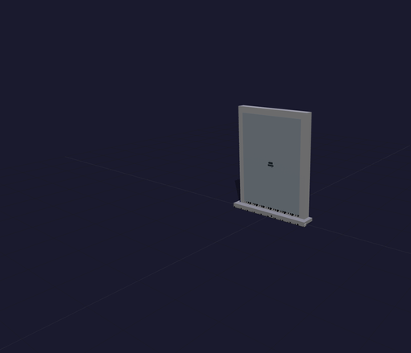 | 740 | 2,100 | 11 | Double-hung window with sill | 6 | Clean frame; sill detail; glass panes |
| `staircase` | 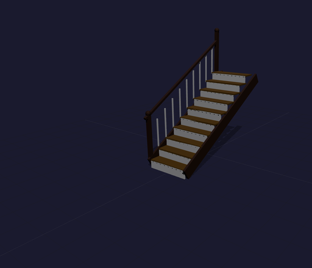 | 568 | 1,296 | 36 | Stairs with railings | 6 | Many objects for stair treads; railings with balusters; functional |
| `wall-section` | 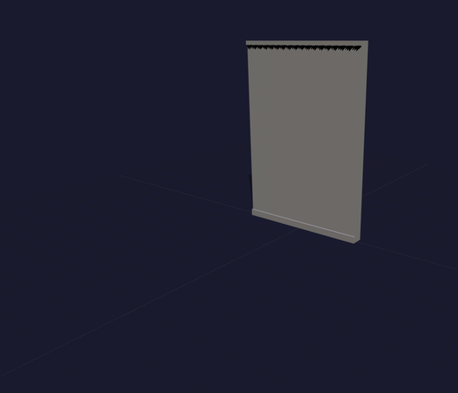 | 36 | 72 | 3 | Modular 2m wall with baseboard and crown | 6 | Very low poly but clean; baseboard and crown molding; modular |
| `floor-tile` | 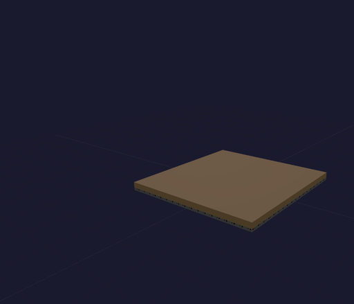 | 24 | 48 | 2 | Modular 2m x 2m floor section | 5 | Minimal — wood surface on concrete sub; functional for room building |
| `roof-section` | 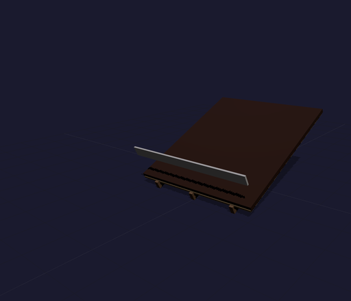 | 72 | 144 | 6 | Angled roof panel with rafters and fascia | 6 | 25-degree pitch; visible rafters; fascia trim; tileable |
| `fence-section` |  | 172 | 350 | 15 | Wooden picket fence, 2m wide | 6 | Post caps, 9 pickets, top/bottom rails; weathered wood material |

**Building avg quality: 6.0**

---

## Street & Outdoor (10)

| Prefab | Thumbnail | Tris | Verts | Obj | Description | Quality | Issues |
|--------|-----------|------|-------|-----|-------------|---------|--------|
| `street-lamp` | 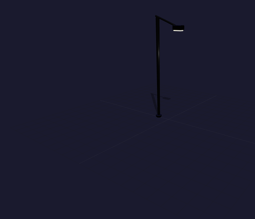 | 1,328 | 3,864 | 5 | Street light pole with lantern | 6 | Good proportions; lantern head; emissive light element |
| `traffic-light` | 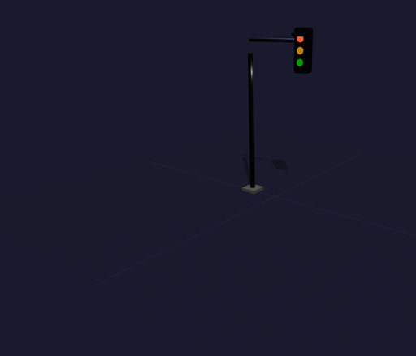 | 828 | 2,204 | 8 | Traffic signal on pole with arm | 7 | Emissive R/Y/G lights; visor; concrete base; reads clearly |
| `stop-sign` | 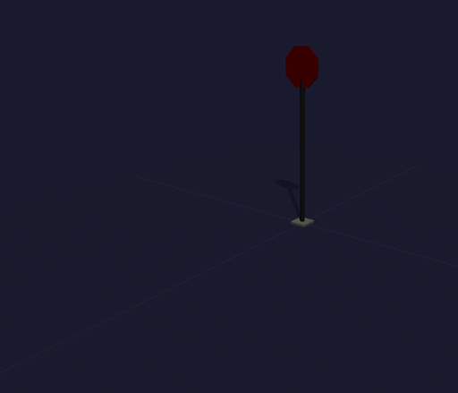 | 112 | 268 | 5 | Octagonal stop sign on pole | 6 | Prism octagon; red/white face; bracket detail; low poly |
| `bus-stop` | 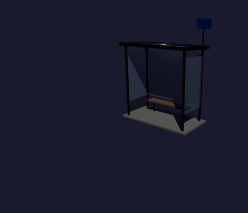 | 2,004 | 5,860 | 14 | Bus shelter with glass, bench, route sign | 7 | Glass panels, steel frame, wooden bench, blue route sign |
| `power-pole` | 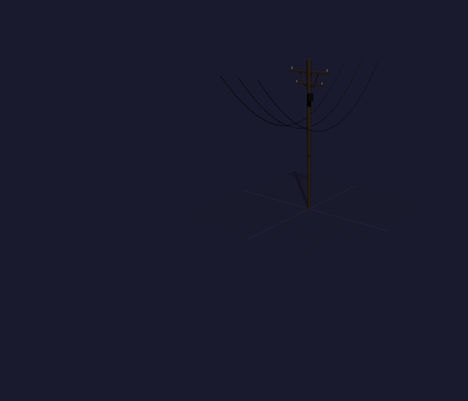 | 712 | 715 | 14 | Utility pole with crossarms and catenary wires | 7 | Drooping wires; ceramic insulators; transformer; braces |
| `park-bench` | 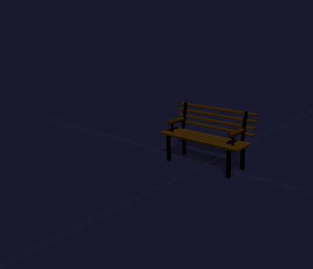 | 6,320 | 18,840 | 20 | Wooden park bench with metal frame | 7 | High detail for a bench; rounded slats; cast iron legs |
| `trash-can` | 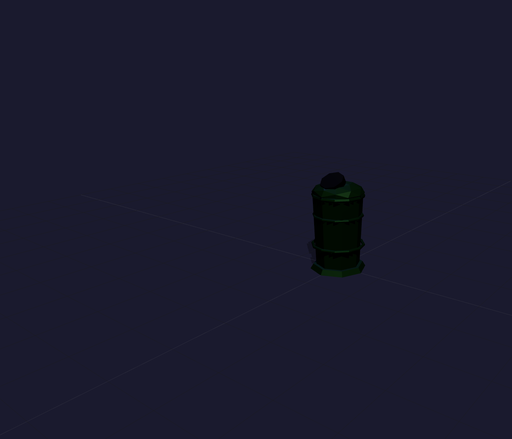 | 752 | 747 | 7 | Public waste bin | 5 | Cylindrical bin with lid; basic but readable |
| `fire-hydrant` |  | 492 | 825 | 14 | Red fire hydrant | 6 | Classic red hydrant shape; multiple parts; small but correct |
| `shopping-cart` | 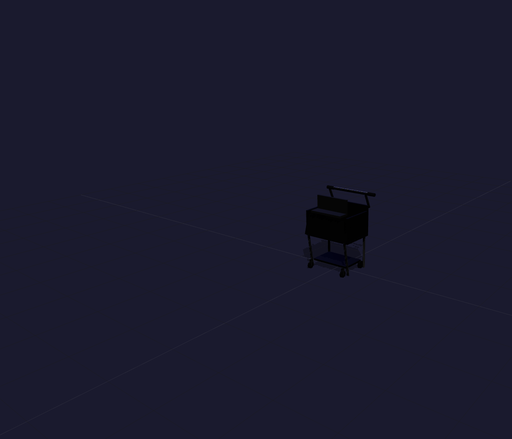 | 504 | 864 | 23 | Metal shopping cart | 5 | Many small parts; very dark/hard to see; correct shape |
| `bike-handlebars` | 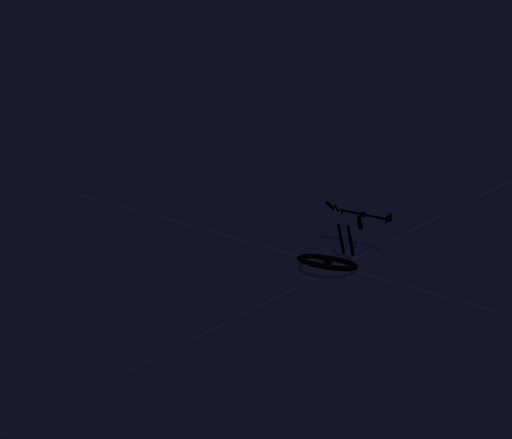 | 656 | 829 | 19 | First-person bike view (handlebars + wheel) | 5 | Niche use case; POV perspective prop |

**Street avg quality: 6.0**

---

## Figures & Structures (6)

| Prefab | Thumbnail | Tris | Verts | Obj | Description | Quality | Issues |
|--------|-----------|------|-------|-----|-------------|---------|--------|
| `human-figure` | 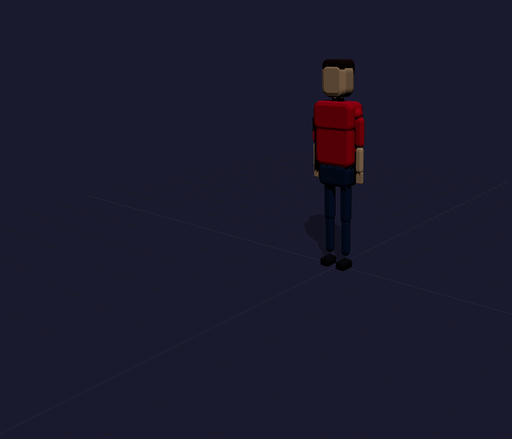 | 6,628 | 17,820 | 20 | Standing person, red shirt, jeans | 6 | Minecraft-style blocky person; good for scale reference; no face detail |
| `human-sitting` | 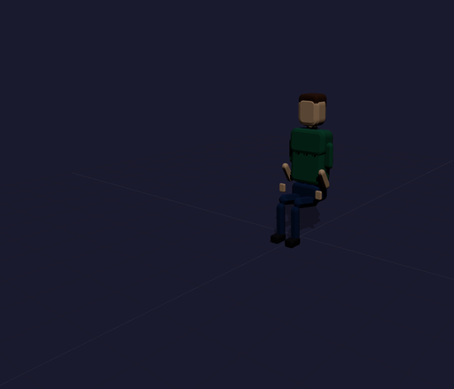 | 6,468 | 17,340 | 18 | Seated person, green shirt, jeans | 6 | Legs bent at 80deg; arms resting on lap; pairs with benches/chairs |
| `seven-eleven` | 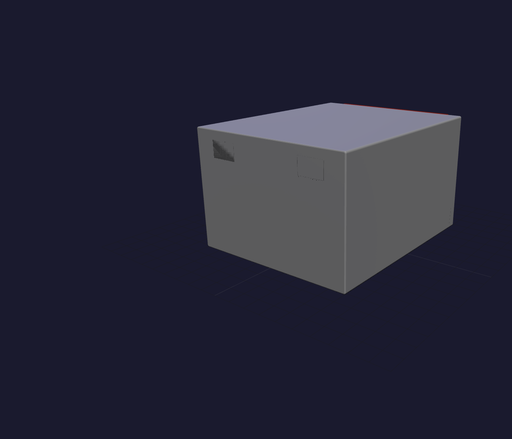 | 8,712 | 26,092 | 15 | Convenience store building | 6 | Boxy shop with door, window, AC unit; recognizable; no interior |
| `street-vendor` | 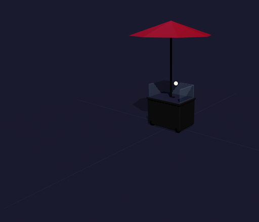 | 3,300 | 9,743 | 10 | Food cart with umbrella | 7 | Red umbrella, cart, light — charming street scene prop |
| `shipping-container` | 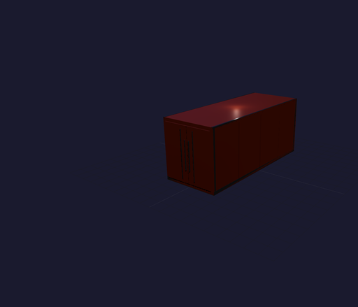 | 288 | 544 | 20 | 20ft shipping container, orange | 7 | Corner posts, side ribs, double doors, locking bars; versatile |
| `prefab-test` | 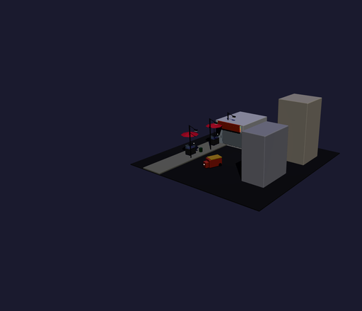 | 47,844 | 139,120 | 172 | Test scene with multiple prefabs | N/A | Meta-scene combining many prefabs; not for direct use |

**Figures avg quality: 6.4** (excluding prefab-test)

---

## Industrial & Ruin (9)

| Prefab | Thumbnail | Tris | Verts | Obj | Description | Quality | Issues |
|--------|-----------|------|-------|-----|-------------|---------|--------|
| `catwalk-segment` | 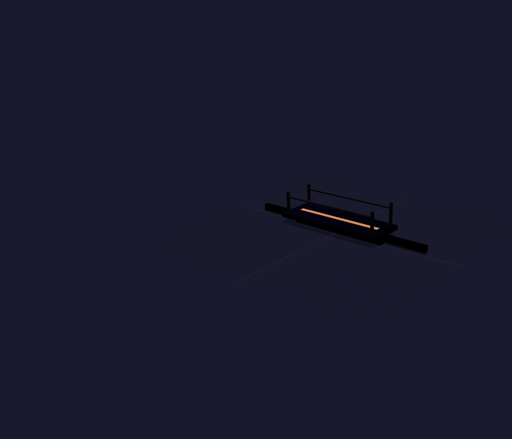 | 279 | 729 | 12 | Grated catwalk with rails and hazard glow | 6 | Orange glow strip; modular design; dark but atmospheric |
| `pipe-rack` | 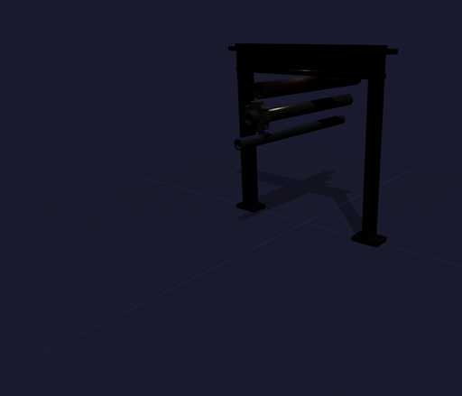 | 2,294 | 6,882 | 7 | Steel rack with bundled pipes and valve wheel | 7 | Good industrial detail; valve wheel; pipe bundle; material breakup |
| `factory-wall-bay` | 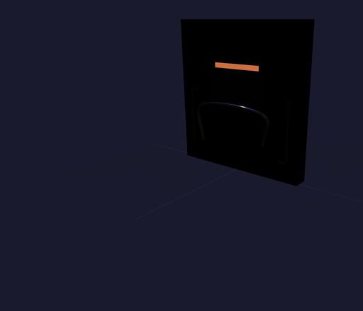 | 636 | 633 | 6 | Machine wall panel with conduit and warning slot | 6 | Uses advanced materials (breakup, decals, grime); very dark |
| `broken-column` | 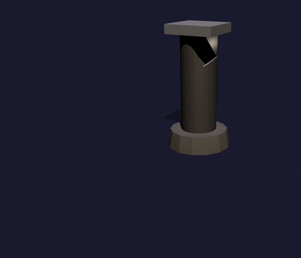 | 443 | 1,237 | 3 | Pale civic column broken at top | 6 | CSG-cut break; good ruin aesthetic; base pedestal |
| `arch-fragment` | 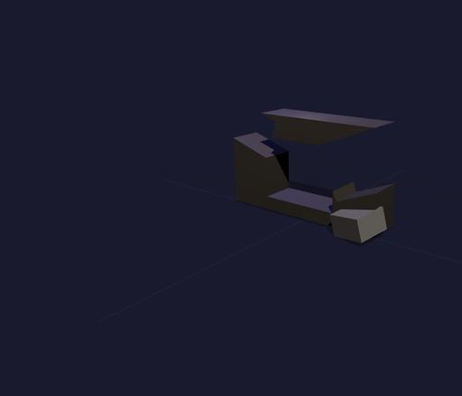 | 131 | 381 | 2 | Broken arch chunk with debris block | 5 | Very simple — just 2 boxes; needs more breakup and detail |
| `machine-altar` | 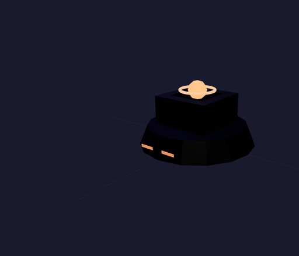 | 804 | 911 | 8 | Boss/ritual pedestal with emissive core | 7 | Great atmosphere; glowing core; tiered base; dark/moody |
| `hazard-gate` | 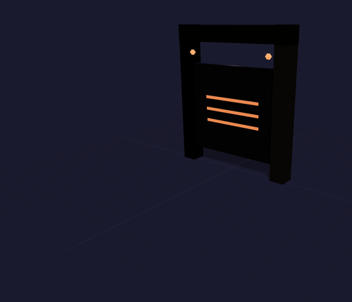 | 124 | 288 | 9 | Heavy gate frame with warning strips and sensors | 7 | Orange warning strips; sensor lights; strong industrial read |
| `rubble-pile` | 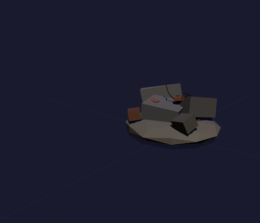 | 300 | 522 | 14 | Concrete/brick rubble with rebar | 7 | Mixed materials; wedge slab, bricks, rebar cables; dust mound base |
| `collapsed-wall` | 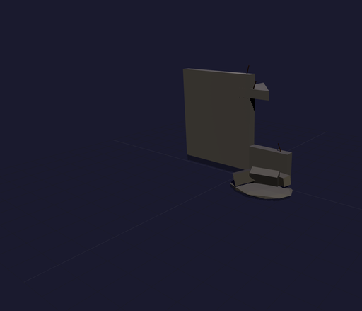 | 196 | 468 | 12 | Partially collapsed wall with debris | 7 | Standing section + broken edge; fallen chunks; exposed rebar |

**Industrial avg quality: 6.4**

---

## Nature & Terrain (2)

| Prefab | Thumbnail | Tris | Verts | Obj | Description | Quality | Issues |
|--------|-----------|------|-------|-----|-------------|---------|--------|
| `rock-large` | 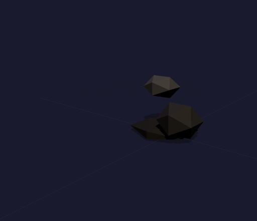 | 60 | 180 | 6 | Large irregular boulder | 6 | Dodecahedron + lobes for organic shape; chip fragments; very low poly |
| `rock-cluster` | 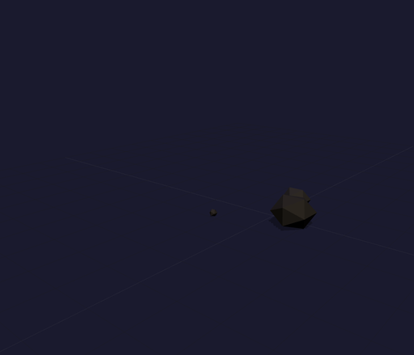 | 60 | 180 | 9 | Group of smaller rocks | 6 | 5 rocks + 4 pebbles; varied sizes and shapes; good scatter prop |

**Nature avg quality: 6.0**

---

## Quality Distribution

| Rating | Count | Prefabs |
|--------|-------|---------|
| 4 | 6 | sports-car, suv, van, scooter, side-table, wardrobe |
| 5 | 21 | oak-tree, pine-tree, willow-tree, cypress-tree, hedge-box, shrub-round, office-chair, kitchen-chair, coffee-table, tv-stand, dresser, floor-lamp, table-lamp, bus, bicycle, trash-can, shopping-cart, bike-handlebars, arch-fragment, floor-tile |
| 6 | 27 | sedan, pickup-truck, tuk-tuk, speedboat, birch-tree, palm-tree, maple-tree, lowpoly-tree, bush-flowering, topiary-spiral, armchair, desk, window, staircase, street-lamp, fire-hydrant, human-figure, human-sitting, seven-eleven, catwalk-segment, factory-wall-bay, broken-column, wall-section, roof-section, fence-section, stop-sign, rock-large, rock-cluster |
| 7 | 22 | motorbike, bed, sofa, dining-table, bookshelf, door, park-bench, street-vendor, pipe-rack, machine-altar, hazard-gate, truck-semi, dead-tree, kitchen-counter, refrigerator, stove, traffic-light, bus-stop, power-pole, shipping-container, rubble-pile, collapsed-wall |

---

## Full Screenshots

Full multi-angle screenshots (normal, wireframe, design-grid) for each prefab are archived at `/tmp/prefab-inspect/<prefab-name>/`.
