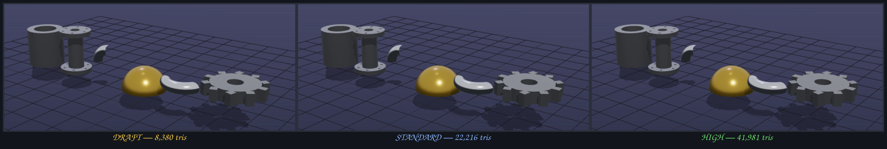

# Render Tiers

`scene.quality` is a **performance knob, not a quality knob.** It scales tessellation, nothing else.

- `draft` — cheap segment counts. Fast iteration.
- `standard` — the default. Believable curves.
- `high` — final render. Dense tessellation, denser sphere detail.

More triangles is not better art. A low-poly asset lives or dies on proportion, silhouette, correct features, and believable scale — none of which this knob touches. Use `draft` while you iterate on the model, `high` when you render it out. Don't reach for `high` to fix a model that reads wrong; fix the model.

The tier scales cylinder/cone/torus/ring segments, sphere and platonic-solid subdivision, cables, and every curved CSG primitive. It never changes a shape's identity — a hexagonal prism stays six-sided, gear teeth stay counted.

## Same spec, three tiers

Locked camera. Only `scene.quality` changes.

8,446 → 42,049 triangles for a barely-different silhouette. That gap is the point: past `standard`, you are mostly spending vertices, not buying quality. The curved read (dome, elbow) tightens a little; the shapes are the same shapes.

## What quality actually means here

Tris are cheap and measurable, so they are easy to mistake for quality. They aren't it. Quality is:

- **Proportion and scale** — a truck cab a person fits in, a wheel that matches the body, a door a human walks through.
- **Feature correctness** — a gear whose teeth point out, a speaker where the speaker goes.
- **Silhouette and stance** — the read at a glance, grounded, not floating.
- **Material and colour** — flat-shading, palettes, believable surface reads.

`make golden` fingerprints anchors by triangle/vertex/object count. It guards the *pipeline* — a builder change can't silently move geometry. It does **not** guard the *art*; a model can pass every count and still read wrong. Judging that is a job for the eye and the screenshot loop, not a number.

## Rules

- The tier is applied **before** geometry is built. `scene.quality` takes effect on the first build.
- Default is `standard`.
- Pin `high` on final specs; iterate at `draft` or `standard`.
- Box shapes have no segments to scale — the tier is a no-op for them.

## Opting out per part

Segment counts that are *identity* rather than tessellation — a hex limb IS 6-sided — set `options: { "exactSegments": true }` on the part. Quality tiers then leave its segments and sphere detail untouched at every tier. `prism.sides` and `stairs.steps` are always exempt; `exactSegments` extends the same rule to cylinders, capsules, spheres, and the rest. Reference: `specs/examples/segmented-figures.json` (deliberately faceted md2 figures).
